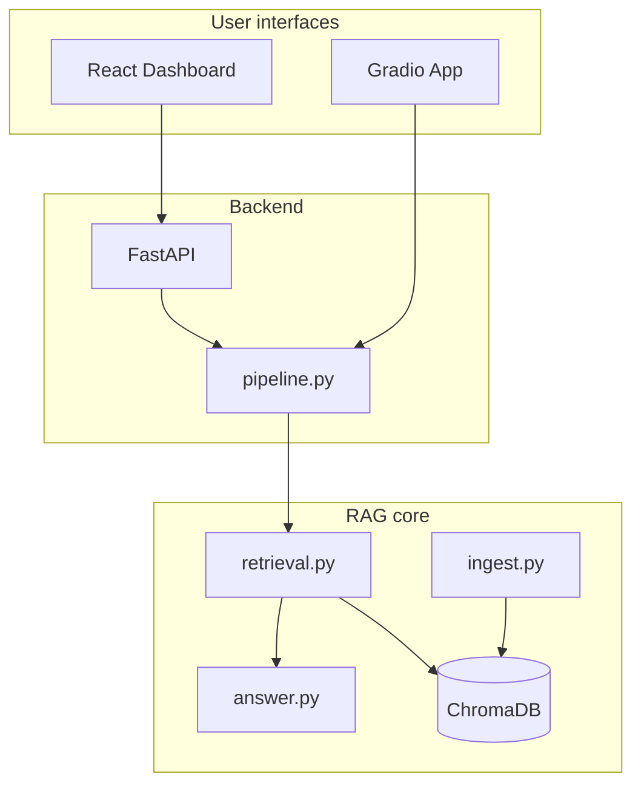

# Insurellm Knowledge Assistant

[](https://www.python.org/)
[](https://react.dev/)
[](https://fastapi.tiangolo.com/)
[](LICENSE)

**Enterprise-grade Retrieval-Augmented Generation (RAG)** over a corporate knowledge base — products, employees, contracts, and company documentation. Built as a portfolio project demonstrating advanced LLM engineering: ingestion, embeddings, semantic search, query rewriting, reranking, grounded generation, and a production SaaS dashboard.

| | |
|---|---|
| **Author** | Arsal Kamran |
| **Contact** | [arsalkgalid.62@gmail.com](mailto:arsalkgalid.62@gmail.com) |
| **Course context** | LLM Engineering — Week 5 (Insurellm RAG) |

---

## Highlights for recruiters

- **Dual UI**: React enterprise dashboard + Gradio prototype
- **Advanced RAG**: Query rewrite → dual vector search → LLM rerank → grounded answer
- **Explainability**: Source panel with relevance %, highlighted excerpts, pipeline timing
- **Analytics**: Session metrics, KB stats, per-stage latency breakdown
- **Production patterns**: Modular Python package, FastAPI API, TypeScript frontend, env-based config

---

## Screenshots

| Enterprise dashboard | RAG pipeline |
|--------------------|--------------|
| React chat + sources + analytics | Query → Embed → Search → Rerank → LLM |

*Run locally to view — see [Getting Started](docs/GETTING_STARTED.md).*

---

## Quick start

### Prerequisites

- Python 3.10+
- Node.js 18+ (for React dashboard)
- [OpenAI API key](https://platform.openai.com/api-keys)

### 1. Clone and configure

```bash
git clone https://github.com/YOUR_GITHUB_USERNAME/insurellm-rag-assistant.git
cd insurellm-rag-assistant

python -m venv .venv
# Windows
.venv\Scripts\activate
# macOS/Linux
source .venv/bin/activate

pip install -r requirements.txt
cp .env.example .env
# Edit .env — set OPENAI_API_KEY
```

### 2. Build the vector index

```bash
python scripts/ingest.py
```

Fast mode (~2–5 min). For higher-quality chunks: `python scripts/ingest.py --smart`

### 3a. Enterprise dashboard (recommended)

```bash
# Terminal 1 — API
.venv/Scripts/python.exe scripts/run_api.py

# Terminal 2 — Frontend
cd frontend
npm install
npm run dev
```

Open **http://localhost:5173** (or the port Vite prints).

### 3b. Gradio UI (alternative)

```bash
python app.py
```

Opens **http://127.0.0.1:7860**

---

## Architecture



| Document | Description |
|----------|-------------|
| [docs/GETTING_STARTED.md](docs/GETTING_STARTED.md) | Full setup, SSL fixes, troubleshooting |
| [docs/ARCHITECTURE.md](docs/ARCHITECTURE.md) | Python modules and data flow |
| [docs/DASHBOARD.md](docs/DASHBOARD.md) | React + FastAPI dashboard |
| [docs/FRONTEND_ARCHITECTURE.md](docs/FRONTEND_ARCHITECTURE.md) | React component tree |
| [docs/API.md](docs/API.md) | REST endpoints |
| [docs/GITHUB_SETUP.md](docs/GITHUB_SETUP.md) | Push to GitHub |

---

## Project structure

```
insurellm-rag-assistant/
├── api/                    # FastAPI server
│   └── main.py
├── frontend/               # React + Tailwind + Framer Motion
│   └── src/
├── src/insurellm_rag/      # RAG engine
│   ├── ingest.py
│   ├── retrieval.py
│   ├── answer.py
│   ├── pipeline.py         # Instrumented pipeline + metrics
│   └── ssl_fix.py          # Windows SSL workaround
├── scripts/
│   ├── ingest.py
│   └── run_api.py
├── knowledge-base/         # 76 markdown documents
├── app.py                  # Gradio UI
├── requirements.txt
└── docs/
```

---

## Configuration

| Variable | Default | Description |
|----------|---------|-------------|
| `OPENAI_API_KEY` | — | **Required** |
| `CHAT_MODEL` | `openai/gpt-4.1-mini` | LiteLLM chat / rewrite / rerank |
| `EMBEDDING_MODEL` | `text-embedding-3-large` | Embeddings |
| `RETRIEVAL_K` | `20` | Chunks per search leg |
| `FINAL_K` | `10` | Chunks sent to LLM |

See [.env.example](.env.example) for all options.

---

## Tech stack

| Layer | Technologies |
|-------|----------------|
| RAG | ChromaDB, OpenAI embeddings, LiteLLM, Pydantic |
| API | FastAPI, Uvicorn, SSE streaming |
| Frontend | React 18, TypeScript, Vite, Tailwind, Framer Motion, Lucide |
| Legacy UI | Gradio 6 |

---

## Knowledge base

Synthetic **Insurellm** corporate dataset (safe to publish):

- `company/` — overview, culture, careers  
- `products/` — Carllm, Healthllm, Lifellm, …  
- `employees/` — staff profiles  
- `contracts/` — client agreements  

---

## License

MIT — see [LICENSE](LICENSE).

## Acknowledgments

Knowledge base and RAG patterns from the [LLM Engineering](https://github.com/ed-donner/llm_engineering) Week 5 curriculum. This repository is an independent portfolio implementation by **Arsal Kamran**.
